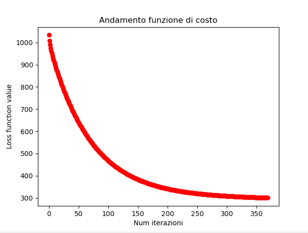
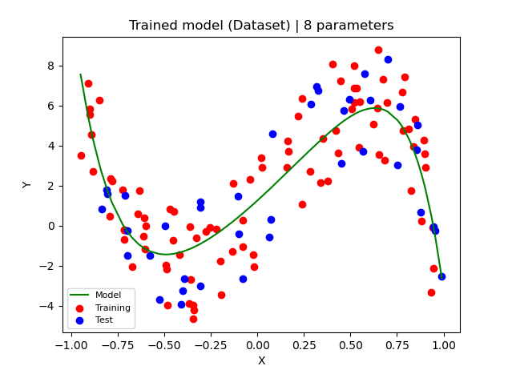
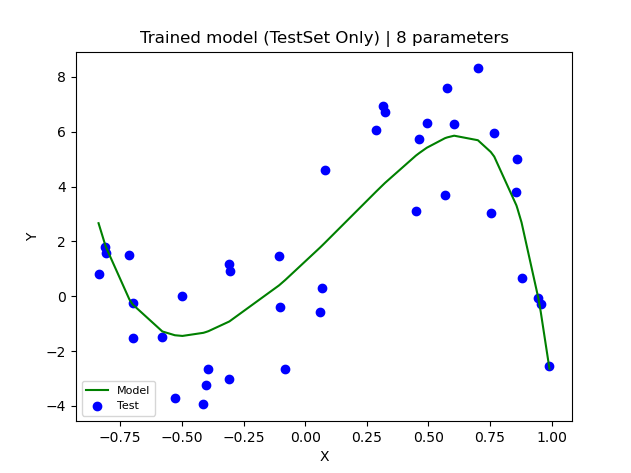
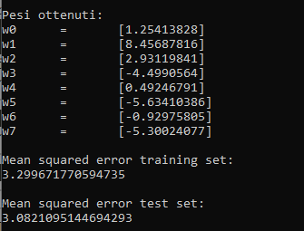

# Polynomial_Regression_from_Scratch
Software per l'analisi dell'andamento di un dataset monodimensionale 

Dato un modello polinomiale descritto da coefficienti (o pesi) associati a un polinomio, si vuole minimizzare la discrepanza tra 
le predizioni fatte dell'attuale polinomio o le reali coordinate Y di punti monodimensionali, in modo da avere un polinomio che descriva il corretto 
trend dei pattern.

Per modificare il polinomio si sceglie una Funzione di Costo che costituisca una metrica di errore da voler minimizzare (L2 Loss), e tramite l'algoritmo del Gradient Descent si 
aggiornano i coefficienti del polinomio seguendo la direzione opposta al gradiente rispetto ai pesi, in modo da minimizzare gli errori.

Come stop condition è stata fissata una soglia per il modulo del gradiente, poichè intorno a un minimo il modulo del gradiente tende a 0.

Eseguendo l'algoritmo (solo sul training Set) si può vedere come varia la funzione di costo di iterazione in iterazione

    

E si può controllare visivamente se l'andamento è corretto:

    

    

A schermo vengono mostrati i pesi computati e una misura di validazione del modello (MSE).

Per controllare se vi è Overfitting viene fatta la validazione sia sui dati del training set che sui dati del test Set:

    

# Sviluppi futuri #

  - ***Scelta del modello***: In questo momento è scelto come modello un polinomio di grado 7. Ma la scelta del modello deve essere validata. Occorre estrarre dal dataset anche un validation Set da utilizzare solo per il calcolo del modello migliore da utilizzare.
 
  - ***Regolarizzazione***: Per prevenire ulteriormente l'overfitting occorre regolarizzare la L2 Loss aggiungendo un termine che costituisce il modulo del gradiente al quadrato e cambiare quindi le derivate parziali. (Tipicamente in overfitting i pesi divergono verso valori altissimi)
   
